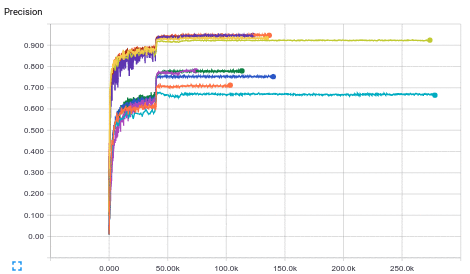
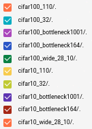

<font size=4><b>Reproduced ResNet on CIFAR-10 and CIFAR-100 dataset.</b></font>

contact: panyx0718 (xpan@google.com)

<b>Dataset:</b>

https://www.cs.toronto.edu/~kriz/cifar.html

<b>Related papers:</b>

Identity Mappings in Deep Residual Networks

https://arxiv.org/pdf/1603.05027v2.pdf

Deep Residual Learning for Image Recognition

https://arxiv.org/pdf/1512.03385v1.pdf

Wide Residual Networks

https://arxiv.org/pdf/1605.07146v1.pdf

<b>Settings:</b>

* Random split 50k training set into 45k/5k train/eval split.
* Pad to 36x36 and random crop. Horizontal flip. Per-image whitening.
* Momentum optimizer 0.9.
* Learning rate schedule: 0.1 (40k), 0.01 (60k), 0.001 (>60k).
* L2 weight decay: 0.002.
* Batch size: 128. (28-10 wide and 1001 layer bottleneck use 64)

<b>Results:</b>





CIFAR-10 Model|Best Precision|Steps
--------------|--------------|------
32 layer|92.5%|~80k
110 layer|93.6%|~80k
164 layer bottleneck|94.5%|~80k
1001 layer bottleneck|94.9%|~80k
28-10 wide|95%|~90k

CIFAR-100 Model|Best Precision|Steps
---------------|--------------|-----
32 layer|68.1%|~45k
110 layer|71.3%|~60k
164 layer bottleneck|75.7%|~50k
1001 layer bottleneck|78.2%|~70k
28-10 wide|78.3%|~70k

<b>Prerequisite:</b>

1. Install TensorFlow, Bazel.

2. Download CIFAR-10/CIFAR-100 dataset.

```shell
curl -o cifar-10-binary.tar.gz https://www.cs.toronto.edu/~kriz/cifar-10-binary.tar.gz
curl -o cifar-100-binary.tar.gz https://www.cs.toronto.edu/~kriz/cifar-100-binary.tar.gz
```

<b>How to run:</b>

```shell
# cd to the models repository and run with bash. Expected command output shown.
# The directory should contain an empty WORKSPACE file, the resnet code, and the cifar10 dataset.
# Note: The user can split 5k from train set for eval set.
$ ls -R
.:
cifar10  resnet  WORKSPACE

./cifar10:
data_batch_1.bin  data_batch_2.bin  data_batch_3.bin  data_batch_4.bin
data_batch_5.bin  test_batch.bin

./resnet:
BUILD  cifar_input.py  g3doc  README.md  resnet_main.py  resnet_model.py

# Build everything for GPU.
$ bazel build -c opt --config=cuda resnet/...

# Train the model.
$ bazel-bin/research/resnet/resnet_main --train_data_path="cifar10/data_batch*" \
                               --log_root=/tmp/resnet_model \
                               --train_dir=/tmp/resnet_model/train \
                               --dataset='cifar10' \
                               --num_gpus=1

# While the model is training, you can also check on its progress using tensorboard:
$ tensorboard --logdir=/tmp/resnet_model

# Evaluate the model.
# Avoid running on the same GPU as the training job at the same time,
# otherwise, you might run out of memory.
$ bazel-bin/research/resnet/resnet_main --eval_data_path=cifar10/test_batch.bin \
                               --log_root=/tmp/resnet_model \
                               --eval_dir=/tmp/resnet_model/test \
                               --mode=eval \
                               --dataset='cifar10' \
                               --num_gpus=0
```

# liangshu

### quick memo (lsdata)

```shell
# Build everything for GPU.
$ bazel build -c opt --config=cuda research/resnet/...

# Train the model.
$ bazel-bin/research/resnet/resnet_main --train_data_path="/Users/Pharrell_WANG/next-workspace/models/research/resnet/lsdata/bin/train.bin" \
                               --log_root=/tmp/resnet_model_for_lsdata \
                               --train_dir=/tmp/resnet_model_for_lsdata/train \
                               --dataset='lsdata' \
                               --num_gpus=1
                               
# Evaluate the model.
# Avoid running on the same GPU as the training job at the same time,
# otherwise, you might run out of memory.
$ bazel-bin/research/resnet/resnet_main --eval_data_path="/Users/Pharrell_WANG/next-workspace/models/research/resnet/lsdata/bin/test.bin" \
                               --log_root=/tmp/resnet_model_for_lsdata \
                               --eval_dir=/tmp/resnet_model_for_lsdata/test \
                               --mode=eval \
                               --dataset='lsdata' \
                               --num_gpus=0                               
```


### note

1. count bytes: (wc: word count)
``wc -c < lsdata/lsdata_train.bin
``

### data processing:

step 1. use `z_label_gen.py`
step 2. use `z_bin_gen.py` Ref:[How to create dataset similar to cifar10](https://stackoverflow.com/questions/35032675/how-to-create-dataset-similar-to-cifar-10/35034287)
